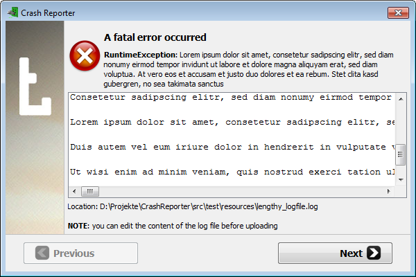

#CrashReporter
**A crash reporting tool**

It enables users to upload their game log and redirects them to different support sites.

### License

This software is licensed under the [Apache 2.0 License](http://www.apache.org/licenses/LICENSE-2.0.html).

### Original

This project is a clone from the one used by the MovingBlocks team.
https://github.com/MovingBlocks/CrashReporter/
